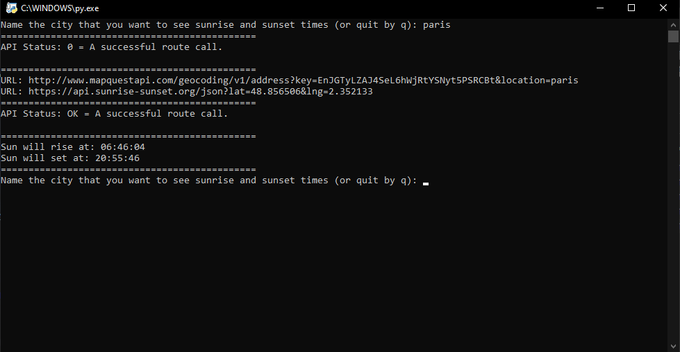

# SunTrack

This is one of my projects, which point is to learn how to use rest APIs and development API key. There is also used tzlocal, pytz, datetime libraries to get user local time and timezone.
The time program gets from the API is edited to user local time. Program is not considering different season times, for example in Finland there is winter and summer times (+1h Winter -> Summer).

SunTrack:

* Is an application that gives sunrise and sunset times to given city.
* Takes user input as 'City', and uses rest API to transfer it into 'lat' and 'lon', and then uses 'lat' and 'lon' to get wanted times.
* Uses 1 open rest API and one with developer API key needed to get information. (Api key can be redeemed at mapquestapi.com.)
* Is good example how to use URLLIB.PARSE and REQUESTS libraries to get json data.
* Is good example how to use PYTZ, TZLOCAL and DATETIME libraries to get user local time.

## To note!
You need your own API key to get access to the mapquest APIs! 
Go to the url 'https://developer.mapquest.com/documentation/'.
Make your own account on the site, and there should be option to get your own key for free.
Mapquest have good instructions to get the key if problems occurs.

## Usage

Simply download the source folder and the code is explained on the .py file.
Then you need to install some libraries with pyinstall:

## Pip install libraries
* Python 3 needs to be installed (You can download it from the official site of python.)
* Pip install urrlib.parse (import urllib.parse)
* Pip install requests (import requests)
* Import datetime	#
* Import time		# These should be installed by default,
* Import pytz		# but if they are not, use pip install,
* Import tzlocal	# to get them or reinstall Python 3.

## Visualization

## News

## Ghange log

## Authors
* Niclas Ekman
